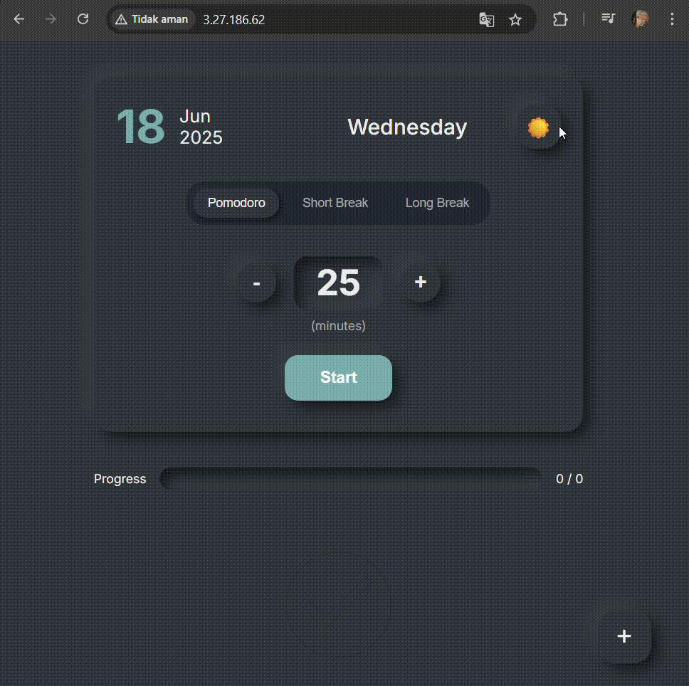

# 📝 Task Tracker

**TaskTracker** adalah aplikasi web modern untuk manajemen tugas harian yang dikembangkan sebagai proyek akhir mata kuliah **Pengembangan Sistem Operasi (PSO B)**. Aplikasi ini dirancang dengan pendekatan DevOps penuh, mulai dari containerisasi dengan Docker hingga pipeline CI/CD otomatis menggunakan GitHub Actions untuk deployment ke AWS.

Repositori ini merupakan hasil *fork* dan pengembangan lanjutan dari [cassidoo/todometer](https://github.com/cassidoo/todometer), dengan penambahan pipeline CI/CD serta pengemasan dalam container Docker.

---

## ✨ Fitur Utama

-   **Manajemen Tugas Dinamis:** Tambah, selesaikan, jeda, dan hapus tugas dengan antarmuka yang intuitif.
-   **Timer Pomodoro Terintegrasi:** Tingkatkan fokus dengan timer Pomodoro yang dapat diatur untuk sesi kerja, istirahat pendek, dan istirahat panjang.
-   **Tampilan Modern:** Antarmuka pengguna yang bersih dengan gaya *neumorphism* dan dukungan **Light/Dark Mode**.

---

## 🖥️ Preview Aplikasi



---

## 👥 Tim Pengembang – Kelompok 13 (PSO B)

-   **Viqi Alvianto** – `5026221001`
-   **Muhammad Fauzan** – `5026221080`
-   **Adithya Eka Pramudita** – `5026221164`
-   **Achmad Fahmi Ainur Ridho** – `5026221167`

---

## Deskripsi Proyek
Aplikasi ini adalah sebuah To-Do List yang dirancang untuk membantu pengguna mengelola pekerjaan harian. Fitur utamanya meliputi:
- Manajemen Tugas: Menambah, menyelesaikan, dan menghapus tugas.
- Timer Pomodoro: Timer terintegrasi untuk membantu fokus saat mengerjakan tugas.

## 🛠️ Tools & Teknologi

| Kategori | Teknologi |
| :--- | :--- |
| **Frontend** |    |
| **Containerization** |   |
| **CI/CD & Testing** |     |
| **Cloud & Deployment**|   |

---

## Alur Kerja (CI/CD)

### Diagram Workflow Sederhana


---

### 1. Continuous Integration (CI) – `ci.yml`

Pipeline ini memastikan kualitas dan keamanan kode sebelum digabung ke branch `main`.
    - **Trigger:** Setiap kali ada **Pull Request** yang dibuat menuju branch `main`
    - Pipeline CI akan otomatis berjalan untuk:
        > **Linting (Code Check):** Menjalankan `ESLint` untuk memeriksa konsistensi dan potensi error pada kode.
        > **Unit Testing:** Menjalankan `Vitest` untuk memverifikasi semua komponen dan fungsi berjalan sesuai harapan.
        > **Build Docker Image:** Jika lolos tes, aplikasi akan di-build dan dikemas ke dalam sebuah Docker Image.
        > **Scan Vulnerabilities:** Image yang sudah di-build akan dipindai oleh `Trivy` untuk mendeteksi kerentanan keamanan tingkat `HIGH` dan `CRITICAL`.
        > **Push to Docker Hub:** Jika aman, image akan diunggah ke Docker Hub agar siap untuk di-deploy.

### 2. Continuous Deployment (CD) – `cd.yml`

Pipeline ini secara otomatis men-deploy versi aplikasi terbaru ke server produksi (AWS EC2) yang telah disiapkan sebelumnya.
    - **Trigger:** Setiap kali ada **Push/Merge** ke branch `main`.
    - Pipeline CD akan:
        >  **Connect to Server:** GitHub Actions membuat koneksi aman ke server **AWS EC2** menggunakan SSH.
        > **Pull Latest Image:** Server menarik Docker Image versi terbaru dari Docker Hub.
        > **Run with Docker Compose:** Kontainer lama dihentikan dan kontainer baru dijalankan dari image terbaru menggunakan `docker-compose`, membuat aplikasi versi baru langsung aktif.

---

## Menjalankan Proyek Secara Lokal
Ikuti langkah-langkah berikut untuk menjalankan aplikasi di lingkungan pengembangan lokal Anda.

Prasyarat
- Node.js (v20 atau lebih baru)
- npm

**Langkah-langkah:**
1.  Clone repositori ini:
    ```bash
    git clone https://github.com/PSO-B-Kelompok-13/demo-repository.git
    cd demo-repository
    ```

2.  Install semua dependensi:
    ```bash
    npm install
    ```

3.  Jalankan server development:
    ```bash
    npm run dev
    ```

## 🔐 Konfigurasi Secrets

Untuk menjalankan pipeline CI/CD di repositori Anda sendiri, konfigurasikan *secrets* berikut di `Settings > Secrets and variables > Actions`:

-   `DOCKER_USERNAME`: Username Docker Hub Anda.
-   `DOCKER_PASSWORD`: Password atau Access Token Docker Hub.
-   `PROD_HOST`: Alamat IP publik dari instance AWS EC2 Anda.
-   `PROD_USER`: Username untuk login ke EC2 (misalnya, `ubuntu` atau `ec2-user`).
-   `PROD_SSH_KEY`: Kunci privat SSH (`.pem`) untuk mengakses instance EC2.
